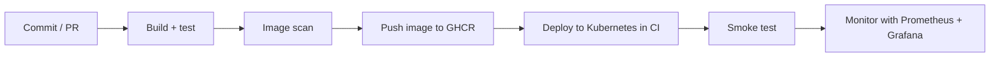

# HelpDeskHQ Platform

A DevOps project: taking an existing .NET + React helpdesk application and building the full delivery system around it, from commit to a running, monitored deployment.

> **Status: work in progress.** This repository is being built step by step. The checklist below shows what is finished. Nothing is claimed here until it is built and proven.

## What this project is about

The application is an internal IT and facilities helpdesk with SLA tracking and automatic escalation (ASP.NET Core, PostgreSQL, Hangfire, SignalR, React). The application itself already existed. The goal of this repository is the part around it:

- Containerizing it properly (multi-stage builds, non-root users, health checks)
- A CI pipeline with test gates and image scanning
- Running it on Kubernetes (locally, with kind)
- Creating the environment with infrastructure as code (Terraform or OpenTofu)
- Automated deployment with smoke tests
- Monitoring with Prometheus and Grafana, including an alert

Everything runs locally and on GitHub's free tools. There is no paid cloud in this project, and it is not deployed to a cloud provider.

## Planned flow



## Progress

- [x] Step 0: Repository setup
- [ ] Step 1: Make the app container-ready (configuration, health endpoints)
- [ ] Step 2: Docker and Docker Compose
- [ ] Step 3: Tests and CI (GitHub Actions, Trivy, GHCR)
- [ ] Step 4: Kubernetes on kind
- [ ] Step 5: Infrastructure as code
- [ ] Step 6: Continuous delivery with smoke tests
- [ ] Step 7: Observability (Prometheus, Grafana, alert)
- [ ] Step 8: Documentation, runbook and demo

## Repository layout

```
app/          Application source (backend, frontend, tests)
deploy/       Docker, Kubernetes, Terraform and monitoring files
docs/         Architecture notes, decisions and runbook
.github/      CI/CD workflows
```

## Author

**Dilshan Kumarasingha**, Colombo, Sri Lanka
[GitHub](https://github.com/Dilshan-Kumarasingha) · [Portfolio](https://dilshan-kumarasingha.github.io/) · [LinkedIn](https://www.linkedin.com/in/dilshan-kumarasingha/)

## License

MIT, see [LICENSE](./LICENSE).
